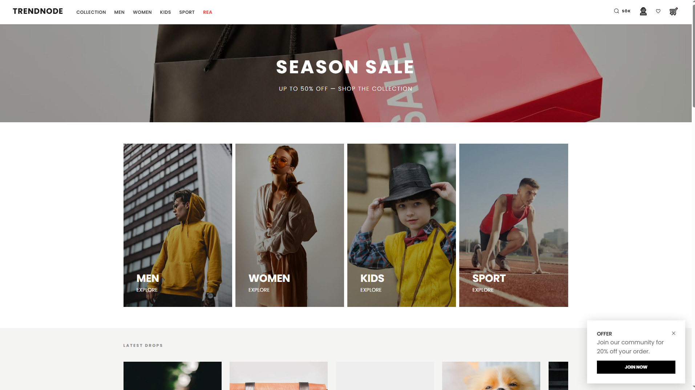
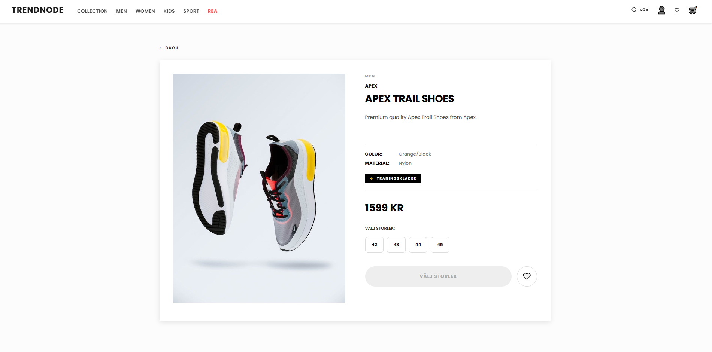
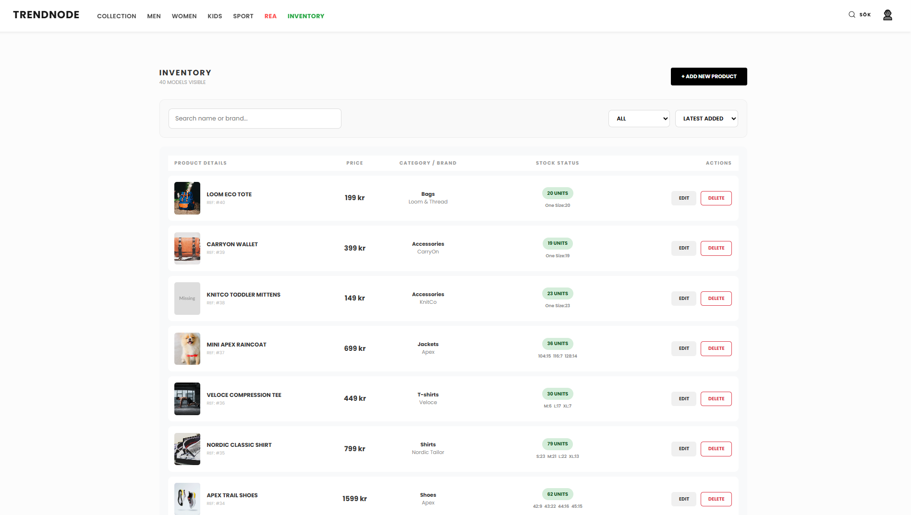
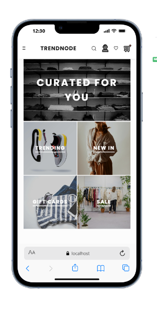
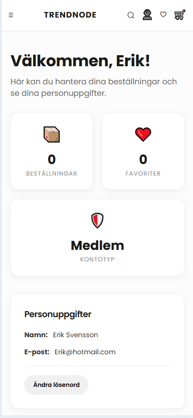

# 🛍️ Modern E-Commerce Storefront

En responsiv och högpresterande e-handelsapplikation byggd med React. Projektet fokuserar på en sömlös användarupplevelse med dynamisk filtrering, bildoptimering och ett rent, skandinaviskt gränssnitt.

---

## 📸 Screenshots

### Desktop Experience
Här ser du den fullständiga vyn av butiken och dess administrativa gränssnitt.

| Home Screen | Product List | Product Detail |
| :---: | :---: | :---: |
|  |  |  |

### Admin & Mobile
Full kontroll över lagret och en optimerad upplevelse för mindre skärmar.

| Admin Dashboard | Mobile Layout | Mobile Profile |
| :---: | :---: | :---: |
|  |  |  |

---

## 🚀 Funktioner

* **Dynamisk Produkthämtning:** Hämtar realtidsdata från ett REST-API.
* **Avancerat Filtersystem:** Synkroniserad filtrering baserad på kategori (t.ex. Shoes, Denim, Jackets) och avdelning (Men, Women, Kids, Sport).
* **Smart Navigering:** "Quick-access puffs" i headern som automatiskt filtrerar och scrollar användaren till relevanta produkter.
* **Bildoptimering:** Använder weserv.nl för on-the-fly storleksändring och caching, vilket resulterar i extremt snabba laddningstider.
* **Favoritsystem:** Möjlighet för inloggade användare att spara produkter med omedelbar UI-uppdatering.
* **Responsiv Design:** Fullt optimerad för mobil, surfplatta och desktop.

---

## 🛠 Tech Stack

* **Frontend:** React (Hooks, Context/State Management)
* **Routing:** React Router DOM (med query-parameter synkronisering)
* **Styling:** Modern CSS (Flexbox, Grid, CSS Variables)
* **API:** RESTful API koppling
* **Verktyg:** Fetch API, LocalStorage för sessionshantering

---

## 💡 Tekniska Utmaningar & Lösningar

### Filterlogik med "Smart Matching"
En stor utmaning var att mappa header-puffarnas generella kategorier (t.ex. "Sneakers") mot databasens specifika namn ("Shoes"). Jag implementerade en förlåtande filter-logik som använder `toLowerCase()` och `includes()` för att säkerställa att användaren alltid ser rätt produkter oavsett språkskillnader i databasen.

### Bildhantering & Placeholders
För att undvika "trasiga bilder" och långsamma laddningstider skapades en robust `getOptimizedImage`-funktion. Den hanterar automatiskt saknade URL:er genom att injicera dynamiska placeholders från *placehold.co* och optimerar tunga Pexels-bilder via en CDN-proxy.
